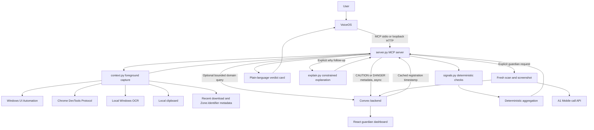
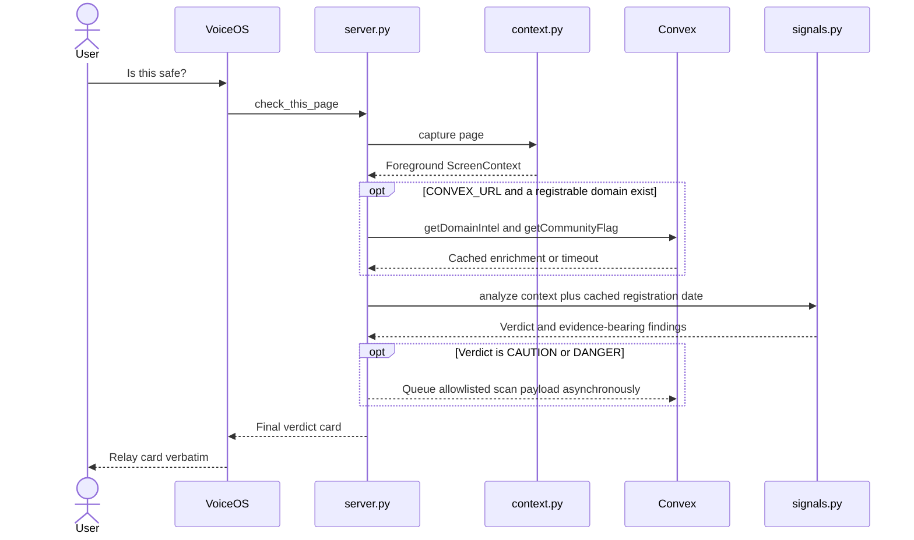
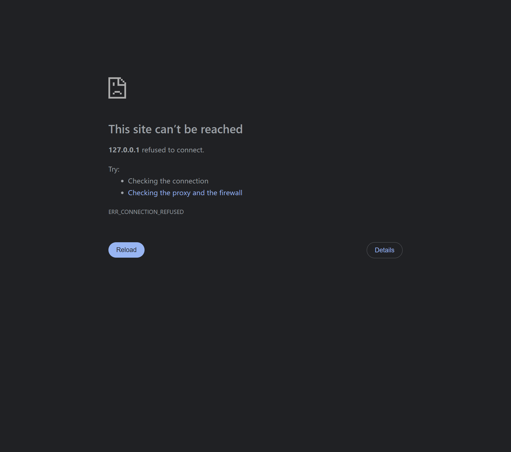

# Something's Phishy

A Windows-first, voice-accessible phishing and scam checker that inspects the active screen, clipboard, and recent download metadata, then explains concrete warning signs in plain language.

> [!WARNING]
> **Prototype, not a security product.** Something's Phishy can miss scams, misread the foreground window, or label an unsafe page `SAFE` when no implemented rule matches. It does not replace antivirus software, a bank's fraud team, or independent verification through an official phone number or app. Do not use it as the sole basis for sending money, entering credentials, opening a file, or approving a wallet transaction.

**Last source and command verification:** August 9, 2026.

## Contents

- [Why this exists](#why-this-exists)
- [What it does](#what-it-does)
- [Five-minute Windows quick start](#five-minute-windows-quick-start)
- [VoiceOS MCP setup](#voiceos-mcp-setup)
- [Configuration](#configuration)
- [MCP tool reference](#mcp-tool-reference)
- [How it works](#how-it-works)
- [Convex and the guardian dashboard](#convex-and-the-guardian-dashboard)
- [Privacy and network egress](#privacy-and-network-egress)
- [Demo lab](#demo-lab)
- [Tests and evaluation](#tests-and-evaluation)
- [Project structure](#project-structure)
- [Troubleshooting](#troubleshooting)
- [Current limitations and security gaps](#current-limitations-and-security-gaps)
- [Roadmap](#roadmap)
- [Primary sources](#primary-sources)

## Why this exists

Phishing is one entry point into a much wider social-engineering problem: fake sign-in pages, impersonation emails, tech-support scares, malicious downloads, copied commands, QR-code lures, crypto-payment requests, and voice calls that convince a legitimate user to perform an attacker-chosen action.

The reported scale is large, but the measurements describe different systems and **must not be added together**:

- The FBI's Internet Crime Complaint Center received **1,008,597 complaints in 2025**, with **$20.877 billion in reported losses**, up 26% from 2024. Phishing/spoofing accounted for **72,984 complaints**.[^ic3]
- The FTC received fraud reports from **2.6 million consumers in 2024**, with **more than $12.5 billion in reported losses**, up 25% from 2023.[^ftc]
- People age 60 and older submitted **201,266 IC3 complaints** and reported **$7.748 billion in losses** in 2025—the highest totals of any IC3 age group.[^ic3]
- APWG observed **971,181 phishing attacks in Q1 2026**, up 13.8% from Q4 2025. This is infrastructure and campaign telemetry, not a victim count.[^apwg]
- Microsoft's ClickFix research describes fake CAPTCHA or error prompts that persuade users to paste and execute attacker-supplied commands, affecting thousands of observed devices per day in its telemetry.[^clickfix]

Reported complaints and losses understate total harm, while vendor telemetry covers only what a provider can observe. See the repository's [full phishing and scam landscape research brief](docs/research/phishing-and-scam-landscape.md) for definitions, age-group findings, citation cautions, and additional primary sources.

## What it does

In plain language: a user asks VoiceOS something like “Is this safe?” Something's Phishy reads what the **foreground** Windows app exposes, checks it against deterministic rules, and returns a short `SAFE`, `CAUTION`, or `DANGER` card with observed evidence. Separate tools cover a page, download, transaction, clipboard, explanation follow-up, and an explicit guardian alert.

### The design principle that matters most

> **Deterministic signals set the verdict. The model is optional and is never allowed to create findings or change `SAFE`, `CAUTION`, or `DANGER`.**

`signals.py` owns the findings and verdict. The initial scan does not call a language model. `explain.py` is intended only to restate already-detected structured findings; it checks that verdict, finding count, order, and codes remain unchanged and falls back to the original text on any timeout or invalid response.

### Current status

This repository is a functional Windows/hackathon prototype with local MCP transports, foreground context capture, deterministic checks, a Convex backend, a React guardian dashboard, a local safety lab, and automated tests. It is **not production-ready**: notably, Convex has no authentication or ownership enforcement, several integrations are placeholders or only partially wired, and evaluation coverage is too small to establish real-world safety.

### Features and capabilities

| Capability | Current behavior | Status |
| --- | --- | --- |
| VoiceOS integration | Local MCP server over stdio or streamable HTTP on `127.0.0.1:8765` | Implemented |
| Six MCP tools | Page, download, transaction, clipboard, follow-up explanation, and guardian alert | Implemented; follow-up has limitations |
| Foreground context capture | UI Automation baseline, matching visible Chrome tab through CDP, local OCR fallback, clipboard, and recent download metadata | Implemented on Windows |
| Deterministic detection | Evidence-bearing checks for links/domains, email identity, checkout forms, social engineering, crypto, ClickFix, and download metadata | Implemented |
| Bounded output | Verdict, at most three highest-severity findings/observations, and one concrete action; capture failure becomes `CAUTION`, not `SAFE` | Implemented |
| Optional domain-age enrichment | Uses a cached Convex RDAP registration timestamp when one is already available | Partially wired |
| Community reputation | Records distinct DANGER reporters and promotes at three reporters | Stored, but does not affect verdicts |
| Similar-scam vector search | Convex action returns up to five 1,536-dimensional matches capped at supporting severity | Available, but not called by scans |
| Guardian dashboard | React/Vite UI with active alerts, history, screenshots, acknowledgement, circle management, UI perspective toggles, and seeded fallback mode | Prototype |
| Guardian escalation | Explicit tool queues a scan and screenshot to Convex and attempts an A1 Mobile call | Optional prototype integration |
| Evaluation harness | Runs scrubbed local snapshots without opening extracted phishing URLs | Implemented |
| Local demo lab | Inert scenarios for checkout, email, OCR, crypto, and download checks | Implemented |

### Non-goals

Something's Phishy currently does **not** attempt to:

- certify that a page, file, message, or transaction is safe;
- replace Microsoft Defender, endpoint detection, a sandbox, or file-byte malware analysis;
- automatically click, close, block, delete, quarantine, report, call a bank, or contact emergency services;
- let a language model decide whether something is malicious;
- upload the full screen, clipboard, browsing history, or email body during routine checks;
- run as a cloud screen-capture service—the MCP process must run in the interactive Windows session it is inspecting;
- monitor continuously in the background; checks are user- or agent-invoked;
- provide a production-grade guardian identity, consent, authorization, or notification system.

## Five-minute Windows quick start

This path starts only the local fixture server, local MCP server, and a dedicated CDP-enabled Chrome profile. It is safer than `scripts/start-demo.ps1`, which opens several external sites.

### Prerequisites

- Windows 11. Other platforms are not supported by `context.py`.
- Python 3 through the Windows `py` launcher. The project is currently tested with Python 3.13.
- Google Chrome installed in a standard `Program Files` location.
- PowerShell.
- VoiceOS or another MCP client if you want to exercise the voice-facing tools.
- A current Node.js release and npm only if you want Convex or the guardian dashboard.

### 1. Install Python dependencies

Open PowerShell in the existing checkout:

```powershell
# Run from the repository root
py -3 -m venv .venv
.\.venv\Scripts\python.exe -m pip install --upgrade pip
.\.venv\Scripts\python.exe -m pip install -r requirements.txt
```

Using the virtual environment's executable directly avoids PowerShell activation-policy issues.

### 2. Start the local fixtures

Keep this first PowerShell window open:

```powershell
# Run from the repository root
.\.venv\Scripts\python.exe -m http.server 8080 --directory demo-lab
```

### 3. Start MCP over local HTTP

Open a second PowerShell window and keep it open:

```powershell
# Run from the repository root
.\.venv\Scripts\python.exe server.py --http
```

The MCP endpoint is `http://127.0.0.1:8765/mcp`. It is an MCP transport endpoint, not a normal webpage.

### 4. Start the dedicated Chrome profile

Open a third PowerShell window:

```powershell
# Run from the repository root
powershell -ExecutionPolicy Bypass -File .\scripts\start-chrome.ps1
```

In that Chrome window, open <http://127.0.0.1:8080/> and keep the scenario tab in the foreground before checking it.

> [!WARNING]
> The dedicated Chrome profile exposes a debugging endpoint to other processes running as the same Windows user. Use it only for testing. Do not sign into personal, work, banking, healthcare, password-manager, or wallet accounts in this profile.

Optional readiness checks:

```powershell
Invoke-RestMethod http://127.0.0.1:9222/json/version
Test-NetConnection 127.0.0.1 -Port 8765
```

Next, connect VoiceOS using the HTTP instructions below and ask it to run `check_this_page`.

### One-command demo: review before running

> [!CAUTION]
> `scripts/start-demo.ps1` is **not a local-only launcher**. It opens external sites, including `https://ext.to/`, which the script labels as an untrusted test surface and which is a torrent-index surface. It also opens SMCCCD OneLogin, Internet Archive, Logitech G checkout, and ElevenLabs, and it force-stops the current listener on port `8765`. Review the script and your organization's browsing policy before running it. Do not sign in, download anything, install anything, or enter real data on the untrusted surface.

Review first, then run only if you accept those effects:

```powershell
Get-Content .\scripts\start-demo.ps1
powershell -ExecutionPolicy Bypass -File .\scripts\start-demo.ps1
```

The launcher calls `py -3` rather than `.venv\Scripts\python.exe`, so its Python must have the packages from `requirements.txt` available. Prefer the manual startup above when dependencies exist only in the virtual environment.

## VoiceOS MCP setup

The MCP server must run on the same Windows desktop as the content being checked. Do not deploy `server.py` to a remote host: a remote process cannot read this machine's foreground window, clipboard, or Downloads metadata.

VoiceOS versions may label the custom-integration fields differently. The source supports both transport forms below.

### Option A: streamable HTTP

This is the easier development mode because the server has its own visible terminal and logs.

1. Start the server:

   ```powershell
   # Run from the repository root
   .\.venv\Scripts\python.exe server.py --http
   ```

2. In VoiceOS, add a custom MCP integration.
3. Select an HTTP or streamable-HTTP transport if the UI asks.
4. Enter this server URL:

   ```text
   http://127.0.0.1:8765/mcp
   ```

5. Keep the server terminal running. The endpoint has no application-level authentication, but it binds only to loopback.

### Option B: stdio

Use stdio if VoiceOS asks for a local program or launch command instead of a URL. VoiceOS starts and owns the process; do **not** add `--http`.

If the UI has separate fields:

| Field | Value |
| --- | --- |
| Program | `C:\path\to\SomethingsPhishy\.venv\Scripts\python.exe` |
| Arguments | `C:\path\to\SomethingsPhishy\server.py` |
| Working directory, if offered | `C:\path\to\SomethingsPhishy` |

If it has one launch-command field:

```text
"C:\path\to\SomethingsPhishy\.venv\Scripts\python.exe" "C:\path\to\SomethingsPhishy\server.py"
```

`server.py` loads the repository-root `.env.local` by absolute path, so stdio does not depend on VoiceOS inheriting your shell environment or current directory. Standard output is reserved for MCP JSON-RPC; diagnostics go to standard error.

VoiceOS's own [MCP integration guide](https://voiceos.com/guide/build-mcp-integration) is the primary reference for the current UI and registration flow.

### Optional current-user autostart

Review both scripts before enabling autostart:

```powershell
Get-Content .\scripts\install-autostart.ps1
Get-Content .\scripts\run-server.ps1
```

Then install the scheduled task:

```powershell
powershell -ExecutionPolicy Bypass -File .\scripts\install-autostart.ps1
Start-ScheduledTask -TaskName "SomethingsPhishy MCP"
```

The task runs hidden at user logon with a limited interactive token so clipboard and foreground capture work. It uses `ExecutionPolicy Bypass`, invokes global `py -3`, force-stops the current listener on port `8765`, and leaves the unauthenticated loopback MCP endpoint running continuously. Logs go to `%LOCALAPPDATA%\SomethingsPhishy\server.log`. Remove it with:

```powershell
powershell -ExecutionPolicy Bypass -File .\scripts\install-autostart.ps1 -Remove
```

## Configuration

No API key is required for local capture and deterministic analysis. Create `.env.local` in the repository root only for the optional services you use. Both `.env.local` and `dashboard/.env.local` are ignored by Git.

### Environment variables

| Variable | File / consumer | Required? | Purpose and default |
| --- | --- | --- | --- |
| `CONVEX_URL` | Root `.env.local`; Python MCP | Optional | Enables cached domain/community lookups and asynchronous scan recording. Without it, scans stay local. `npx convex dev` normally writes this URL. |
| `CONVEX_DEPLOYMENT` | Root `.env.local`; Convex CLI | CLI-managed | Selects the Convex development deployment. The Python runtime does not read it directly. |
| `SP_USER_ID` | Root `.env.local`; Python MCP | Optional | Logical protected-user ID attached to recorded scans. Defaults to `margaret-demo`. This is not authenticated identity. |
| `DEEPSEEK_API_KEY` | Root `.env.local`; explanation module | Optional | Selects the DeepSeek Anthropic-compatible endpoint for intended explanation calls. Initial verdict scans do not use it. |
| `DEEPSEEK_MODEL` | Root `.env.local`; explanation module | Optional | Overrides the source default `deepseek-v4-flash`. Model availability is not covered by the test suite. |
| `ANTHROPIC_API_KEY` | Root `.env.local`; explanation module | Optional | Fallback provider when no DeepSeek key is set. The source currently requests `claude-sonnet-5`; provider/model availability is not covered by tests. |
| `A1MOBILE_TEAM_KEY` | Root `.env.local`; A1 client | Optional | Sent as `X-Team-Key` when the explicit guardian tool attempts a call. |
| `A1MOBILE_GUARDIAN_PHONE` | Root `.env.local`; A1 client | Required for calls | US ten-digit guardian number; normalized to `+1…`. |
| `A1MOBILE_BASE_URL` | Root `.env.local`; A1 client | Optional | A1 API origin. Defaults to `https://hack.a1mobile.com`. |
| `VITE_CONVEX_URL` | `dashboard/.env.local`; dashboard | Optional | Enables live Convex mode. If absent, the dashboard uses seeded offline UI fixtures. |
| `VITE_GUARDIAN_USER_ID` | `dashboard/.env.local`; dashboard | Optional | Logical guardian ID used by dashboard queries. Defaults to `dan-demo`. It is not authenticated identity. |

Do not put secrets in `dashboard/.env.local`: Vite exposes `VITE_*` values to browser code. `VITE_CONVEX_URL` is a client endpoint, not a secret.

## MCP tool reference

All tools return text for VoiceOS to relay. Scan cards begin with a plain-language verdict, contain at most three evidence/observation bullets, and end with one concrete action when the result provides one.

| Tool | Arguments | Use it for | Important behavior |
| --- | --- | --- | --- |
| `check_this_page` | None | “Is this safe/real?”, webpages, webmail, login forms, checkout pages, pop-ups, and uncertain cases | Captures the active context and runs the general scan. |
| `check_this_download` | None | A recent installer, archive, attachment, executable, or download button | Collects up to five files modified in the last 15 minutes, but analyzes the newest one; includes Mark of the Web metadata when available and never scans file bytes. |
| `check_this_transaction` | None | Crypto payments, copied wallet addresses, wallet approvals, seed-phrase prompts, or address poisoning | Extracts a displayed payment address and an exact clipboard address when possible. It never submits or signs a transaction. |
| `check_my_clipboard` | None | ClickFix-style “press Win+R and paste” instructions or concern about copied commands | Detects command patterns locally. Raw clipboard text is withheld from Convex evidence and model explanation paths. |
| `why_is_that_bad` | `finding_code: string` | A follow-up about one finding from the latest scan | Does not create a new verdict. The current MCP adapter usually falls back to deterministic text; see [limitations](#current-limitations-and-security-gaps). |
| `alert_my_guardian` | None | An explicit request to share the current concern with the configured trusted contact | Performs a fresh local scan, captures the foreground window as an in-memory WebP, attempts to record both in Convex, then attempts an A1 Mobile call. It does not call police, a bank, or emergency services. |

## How it works

### Architecture



Convex is optional for the local verdict. The one remote value that can currently enter deterministic aggregation is a **cached domain registration timestamp**, which can produce `DOMAIN_NEW` or decisive `DOMAIN_VERY_NEW`. Community and vector results are not passed into `analyze()`.

### Scan sequence



The enrichment wrapper is bounded to about 450 ms and the scan-recording wait to about 50 ms. Failures degrade to the local verdict rather than blocking the response.

### Context capture ladder

Capture is foreground-scoped and failure-tolerant. Clipboard collection is local and recent-download collection is included only for `any`/guardian and download-oriented capture, not an ordinary page scan.

| Rung | Source | What it can observe | What is missing or uncertain |
| --- | --- | --- | --- |
| 1 | UIA + matching visible Chrome CDP target + clipboard + optional download metadata | Active URL, up to 20,000 characters of DOM text, up to 300 visible links and destinations, iframe origins, limited sender/reply fields, clipboard, and recent download metadata | Chrome must run with remote debugging on `127.0.0.1:9222`; browser DOM cannot represent image-only content. |
| 2 | Foreground Windows UI Automation + clipboard + optional download metadata | Foreground app/browser text and an exposed URL; works with some native apps | Link destinations, iframe origins, and structured headers may be unavailable. |
| OCR fallback | In-memory screenshot of the foreground window through Pillow + `winocr` | Text painted into a canvas or otherwise inaccessible to DOM/UIA | No reliable links, semantic fields, or URL; OCR can misread text. |
| 3 | Clipboard + recent Downloads metadata | Clipboard text; newest five files modified within 15 minutes; filename, extension, size, modification time, and `Zone.Identifier` fields such as `HostUrl`, `ReferrerUrl`, and `ZoneId` | No page text; absent Mark of the Web means unknown, not safe; file contents are never inspected. |

CDP data is accepted only when a target title matches the foreground window or exactly one CDP page reports itself visible. This prevents an inactive tab title from silently becoming scan evidence when VoiceOS has focus.

### Detection categories

Every finding includes a stable code, severity, title, evidence string, and surface. The main categories are:

| Category | Implemented examples |
| --- | --- |
| Links and domains | Link-text/destination mismatch, homoglyph and one-character lookalikes, brand-as-subdomain, raw IP, punycode, shortened links, insecure login links, and optional cached domain age |
| Email identity | Display-name spoofing, reply-to mismatch, and message-brand/link-domain mismatch; known email-service tracking domains are allowlisted |
| Checkout | Fake Stripe branding without a Stripe-owned frame, unverified payment-frame origin when capture is incomplete, unencrypted non-loopback payment pages, and merchant-brand/domain mismatch |
| Social engineering | Urgency, credential or verification-code requests, irreversible payment rails, and secrecy instructions |
| Crypto | Seed/recovery phrase requests, giveaway patterns, broad token approvals, screen/clipboard address mismatch, and lookalike prior addresses |
| ClickFix and Windows | Win+R/PowerShell instructions paired with paste/Enter, suspicious clipboard commands, antivirus-disable instructions, fake updates, and tech-support scares |
| Download metadata | Double extensions, promised-document/executable mismatch, software impersonation, host/referrer mismatch, missing Mark of the Web evidence, shortcut-in-archive, evasion containers, password-protected archives, pirated-software language, and executable extensions |

The exact finding codes are defined in [`signals.py`](signals.py), which is the source of truth.

### Verdict aggregation

The engine runs each checker independently; one exception cannot take down the entire verdict. It then de-duplicates by finding code, keeps the strongest instance, and sorts by severity.

- **`DANGER`** if any decisive code is present, a critical `CLIPBOARD_PAYLOAD` is present, or there are at least two `HIGH`-or-`CRITICAL` findings.
- **`CAUTION`** if there is exactly one `HIGH`-or-`CRITICAL` finding, or at least one `MEDIUM` finding.
- **`SAFE`** otherwise. A lone `LOW` finding does not raise the verdict.
- **Capture failure** is handled one layer above the engine as `CAUTION` with `CAPTURE_UNAVAILABLE`.
- Only the top three findings are returned in the card; `finding_count` still records the complete de-duplicated count in the in-process result.

Current decisive codes are:

```text
LINK_TEXT_HREF_MISMATCH  HOMOGLYPH_DOMAIN       SEED_PHRASE_REQUEST
ADDRESS_MISMATCH         ADDRESS_POISONING       FAKE_PAYMENT_PROCESSOR
SECRECY_INSTRUCTION      CRYPTO_GIVEAWAY         INSECURE_PAYMENT_PAGE
DOMAIN_VERY_NEW          CLICKFIX_COMMAND        DOUBLE_EXTENSION
DOWNLOAD_TYPE_MISMATCH   FAKE_BROWSER_UPDATE     DISABLE_ANTIVIRUS
TECH_SUPPORT_SCARE
```

`SAFE` means only “no implemented rule raised the current observed context above the threshold.” It is not an allowlist, reputation certificate, or guarantee.

## Convex and the guardian dashboard

### Backend role

The Python scan path remains functional without Convex. When `CONVEX_URL` is configured, Convex provides shared state and optional enrichment:

- cached RDAP domain registration data;
- community DANGER reports;
- asynchronous persistence of non-`SAFE` routine scans;
- guardian links, a reactive alert feed, acknowledgement state, and optional screenshots;
- consent-gated corpus ingestion and a separately public vector-search API, neither of which is part of verdict aggregation;
- scheduled DANGER context lookup after 60 seconds and maintenance crons.

The scheduled alert action currently returns eligible guardian context but has no email/SMS/push delivery provider. The reactive dashboard is the implemented notification surface; the A1 call is a separate explicit local action.

### Data model

| Table | Stored data | Role |
| --- | --- | --- |
| `domainIntel` | Domain, optional registration time/age, optional Safe Browsing placeholder, official-software flag, fetch time, TTL | Caches RDAP-derived domain age. Safe Browsing is not implemented. |
| `communityFlags` | Domain, counts, reporter IDs, top finding codes, timestamps, promoted flag | Promotes after three distinct logical reporter IDs; not used by the verdict engine. |
| `scamCorpus` | PII-scrubbed source text, scam type, provenance, 1,536-value embedding | Optional vector search capped as non-decisive supporting data; not called by scans. |
| `scans` | Logical user ID, surface, verdict, optional domain, codes, scrubbed findings, optional text hash/screenshot, acknowledgement, timestamp | Powers alert history and the dashboard. |
| `guardians` | Protected and guardian logical IDs, optional contact fields, alert preferences, consent timestamp | Controls which logical users appear in a guardian feed. There is no users table or authenticated ownership. |

### Run the dashboard in seeded offline mode

Seeded fallback mode is useful for UI review and requires no Convex deployment. Its rows are illustrative fixtures, **not live detector output or evaluation evidence**. The current seed data references a remote `placehold.co` screenshot, so this mode can still make that image request and is not fully offline.

```powershell
# Run from the repository root
npm --prefix dashboard install
npm run dashboard
```

Open the URL Vite prints, normally <http://localhost:5173>. With no `VITE_CONVEX_URL`, the header shows `Seeded offline mode`.

### Run the dashboard with Convex

> [!WARNING]
> The current Convex backend has no authentication or ownership enforcement. Use only a development deployment with synthetic, non-sensitive data. Do not expose real user scans, screenshots, contact information, or browsing evidence until authorization is implemented.

1. Install root and dashboard packages:

   ```powershell
   # Run from the repository root
   npm install
   npm --prefix dashboard install
   ```

2. Start a Convex development deployment in one terminal:

   ```powershell
   npm run convex
   ```

   Follow the Convex login/project prompts. This normally writes `CONVEX_URL` and `CONVEX_DEPLOYMENT` to root `.env.local`.

3. Create `dashboard/.env.local` using the same deployment URL:

   ```dotenv
   VITE_CONVEX_URL=https://your-development-deployment.convex.cloud
   VITE_GUARDIAN_USER_ID=dan-demo
   ```

4. Ensure root `.env.local` contains the corresponding Python URL and logical protected-user ID:

   ```dotenv
   CONVEX_URL=https://your-development-deployment.convex.cloud
   SP_USER_ID=margaret-demo
   ```

5. Start the dashboard in another terminal:

   ```powershell
   npm run dashboard
   ```

6. In the dashboard's **Circle** view, add the protected ID `margaret-demo` to the default guardian `dan-demo`. This prototype records a consent checkbox/boolean but does not authenticate either person.
7. Run a `CAUTION` or `DANGER` MCP check. Routine `SAFE` checks are intentionally not recorded. Use **Acknowledge** to clear an active alert.

The dashboard supports `?view=guardian|protected` and `?section=active|history|circle`; the UI switchers update those parameters automatically. The `protected` value changes presentation only—both perspectives currently query the guardian feed with the configured guardian ID and are not separate authorization modes.



### Guardian and A1 Mobile flow

`alert_my_guardian` is intentionally separate from routine scans and should be called only after the user explicitly asks for a trusted contact.

1. Capture a fresh foreground context and an in-memory WebP screenshot.
2. Run the deterministic engine locally. This branch does not use cached domain-age enrichment.
3. Queue a Convex scan with surface `guardian`, redacted findings, text hash, and—if upload succeeds—the screenshot.
4. POST the configured US phone number to `{A1MOBILE_BASE_URL}/api/calls` with `A1MOBILE_TEAM_KEY` in the `X-Team-Key` header.
5. Tell the user whether the call was accepted. Convex recording and A1 calling fail independently.

The current response copy and dashboard contain prototype names such as Peyton and Logan. `convex/http.ts` also exposes a static `/voice` XML response, but `a1mobile.py` does not pass that URL in its call request; any callback association depends on external A1 team configuration.

## Privacy and network egress

The project is local-first, but it is not “no network.” Egress depends on configuration and the tool used.

### Stays local during routine checks

- raw clipboard text;
- raw DOM, UIA, and OCR text;
- link lists and iframe lists as a whole;
- Downloads directory listing and file metadata;
- OCR and routine foreground screenshots, which remain in memory;
- downloaded file bytes, which are not read at all.

### May leave the machine

| Trigger | Destination | Data sent |
| --- | --- | --- |
| Any scan with `CONVEX_URL` and a domain | Configured Convex deployment | Registrable domain for cached intel/community queries, including a routine scan that later returns `SAFE` |
| Routine `CAUTION` or `DANGER` recording | Configured Convex deployment | Logical user ID, surface, verdict, domain when present, finding codes, finding titles/evidence, and SHA-256 of normalized page text |
| DANGER community report | Configured Convex deployment | Domain, finding codes, and logical user ID |
| Explicit `alert_my_guardian` | Convex storage/database | The normal scan payload plus a foreground WebP screenshot up to 5 MB |
| Explicit guardian call | A1 Mobile base URL | Guardian phone number; team key is sent as an HTTP header |
| Intended model explanation | DeepSeek or Anthropic | Structured finding code/severity/title/evidence only; no `ScreenContext`. `CLIPBOARD_PAYLOAD` is kept local. The current MCP adapter normally falls back before this call. |
| Manual `intel.refreshDomainIntel` action | `rdap.org` | Registrable domain |
| Seeded dashboard fallback | `placehold.co` | A remote placeholder screenshot referenced by seed data |
| Demo safe checkout | `js.stripe.com` | A sandboxed, non-interactive iframe request; no entered field values |
| `scripts/start-demo.ps1` | Several external websites | Normal browser requests to every external tab listed in the script |

Before a scan is persisted, Convex applies regex scrubbing for email addresses, phone numbers, street-address patterns, and long digit sequences. Raw clipboard evidence is replaced on the Python side with `[withheld: local clipboard contents]`. This is defense in depth, not a complete de-identification guarantee: finding evidence travels to Convex before server-side scrubbing, regexes can miss PII, domains and logical IDs remain identifying, screenshots can contain anything visible, and text hashes can still reveal equality.

## Demo lab

The local lab contains fictional, inert scenarios under `demo-lab/`. Forms do not submit, payment fields are read-only, email links are prevented from navigating, the crypto page has no wallet/RPC/signing path, and `files/invoice.pdf.exe` is plain text rather than executable code.

Results below assume the scenario tab is foreground, CDP is connected, and unrelated clipboard/download state does not add findings.

| Route | Tool | Expected deterministic result |
| --- | --- | --- |
| `/` | `check_this_page` | `SAFE` launcher |
| `/safe-checkout.html` | `check_this_page` | `SAFE` when CDP observes the Stripe-owned iframe |
| `/fake-checkout.html` | `check_this_page` | `DANGER` with `FAKE_PAYMENT_PROCESSOR` |
| `/email.html` | `check_this_page` | `DANGER` with `LINK_TEXT_HREF_MISMATCH`; urgency is also expected |
| `/ocr.html` | `check_this_page` | `DANGER` with `TECH_SUPPORT_SCARE` after OCR fallback |
| `/crypto.html` | `check_this_transaction` | `CAUTION` with `DANGEROUS_APPROVAL` |
| `/download.html` | `check_this_download` after clicking the fixture download | `DANGER` with `DOUBLE_EXTENSION`; never open the downloaded fixture |

The safe-checkout scenario is the local lab's one intentional network dependency: it embeds `https://js.stripe.com/v3/` so CDP can observe a genuine Stripe-owned origin. See [`demo-lab/README.md`](demo-lab/README.md) for scenario-specific safety details.

## Tests and evaluation

### Run validation

```powershell
# Run from the repository root
.\.venv\Scripts\python.exe -m unittest
.\.venv\Scripts\python.exe -m eval.run
npm run test:convex
npm run typecheck
npm --prefix dashboard run build
```

### Current verified results

These results were produced against the current working tree on August 9, 2026:

| Validation | Result |
| --- | --- |
| Python unit tests | **37 passed** in 1.726 s |
| Convex privacy tests | **2 passed** |
| Root TypeScript check | `tsc --noEmit` passed |
| Dashboard production build | `tsc -b && vite build` passed |
| Evaluation controls | **0/8 false positives** (`0.0%`) |
| Evaluation attack snapshots | **48/60 detected**, **12/60 missed** (`80.0%` detection/recall) |
| Harness-reported precision | **100.0%** on this 68-item fixture set |

The evaluation harness uses scrubbed `ScreenContext` snapshots, not live websites. The 60 attack fixtures come from a public Nazario phishing mbox; extracted paths and queries are removed, victim data is scrubbed, and the raw mbox is not committed. “Detected” means the result was not `SAFE`, so both `CAUTION` and `DANGER` count. Eight controls are far too few to estimate production false-positive rates, and 60 older email samples do not represent current multichannel scams, OCR errors, native apps, downloads, or adversarial evasion. Treat these numbers as a reproducible regression baseline, not a safety claim.

See [`eval/README.md`](eval/README.md) for corpus rebuilding and optional JSON/Convex recording commands.

## Project structure

```text
SomethingsPhishy/
├── server.py                 # FastMCP tools, orchestration, card rendering
├── context.py                # Windows UIA/CDP/OCR/clipboard/download capture
├── signals.py                # Deterministic findings and verdict aggregation
├── explain.py                # Constrained optional model explanations
├── convex_client.py          # Failure-tolerant Python Convex client and egress shaping
├── a1mobile.py               # Optional guardian-call client
├── data/
│   ├── brands.py             # Email tracking-domain allowlists
│   └── corpus/               # Scrubbed control and attack JSONL fixtures
├── convex/
│   ├── schema.ts             # Five-table data model
│   ├── scans.ts              # Recording, feeds, screenshots, acknowledgement
│   ├── guardians.ts          # Link/list/unlink prototype consent records
│   ├── intel.ts              # Cached RDAP domain-age actions and queries
│   ├── community.ts          # Distinct-reporter domain flags
│   ├── corpus.ts             # Consent-gated ingestion and vector search
│   ├── alerts.ts             # Scheduled guardian-context lookup
│   ├── privacy.ts            # Persistence-time regex PII scrubbing
│   ├── http.ts               # Static guardian voice XML endpoint
│   └── crons.ts              # Intel expiry and placeholder feed refresh
├── dashboard/                # React + Vite guardian/protected dashboard
├── demo-lab/                 # Inert local browser scenarios
├── eval/                     # Snapshot evaluation runner and corpus builder
├── scripts/
│   ├── start-chrome.ps1      # Dedicated CDP-enabled Chrome profile
│   ├── start-demo.ps1        # Full demo launcher; opens external sites
│   ├── run-server.ps1        # Logged long-running HTTP MCP wrapper
│   └── install-autostart.ps1 # Current-user scheduled-task installer
├── test_signals.py           # Signal and aggregation regressions
├── test_context.py           # Capture, fallback, and MCP safety tests
├── test_a1mobile.py          # Guardian phone/API failure tests
├── tests/convex/             # TypeScript privacy tests
├── docs/research/            # Primary-source phishing landscape brief
├── requirements.txt          # Python dependencies
└── package.json              # Convex, test, dashboard, and typecheck scripts
```

## Troubleshooting

### VoiceOS says the integration is disconnected

- For HTTP mode, confirm the MCP terminal is still running and check:

  ```powershell
  Test-NetConnection 127.0.0.1 -Port 8765
  ```

- For stdio, use the absolute virtual-environment executable and absolute `server.py` path. Do not include `--http`.
- Do not add debug `print()` calls to `server.py` or imported modules in stdio mode; stdout is the MCP protocol wire.
- If port `8765` is occupied, inspect before stopping anything:

  ```powershell
  Get-NetTCPConnection -LocalPort 8765 -State Listen | Select-Object LocalAddress,LocalPort,OwningProcess
  Get-Process -Id <OwningProcess>
  ```

### The check says it could not inspect the active window

- Put the target window in the foreground and retry.
- Confirm Chrome CDP is available:

  ```powershell
  Invoke-RestMethod http://127.0.0.1:9222/json/version
  ```

- Use `scripts/start-chrome.ps1`; ordinary Chrome without `--remote-debugging-port=9222` cannot expose links or iframe origins.
- Ensure `uiautomation`, Pillow, and `winocr` installed successfully from `requirements.txt`.
- OCR can fail on protected windows, minimized windows, remote sessions, unusual display scaling, or unsupported content.

### A legitimate Stripe page returns `CAUTION`

Without CDP iframe evidence, the engine deliberately emits `PAYMENT_ORIGIN_UNVERIFIED` rather than assuming a “Powered by Stripe” label is genuine. Start the dedicated Chrome profile, keep the checkout tab foreground, and retry.

### A recent download is not found

- The capture reads the current user's `Downloads` directory only.
- It collects up to five files modified within the last 15 minutes, then analyzes the newest one.
- Mark of the Web may be absent on files copied locally, produced by some apps, or stored on filesystems that do not preserve NTFS alternate data streams. Absence is unknown, not proof of safety.
- A normal page scan intentionally excludes Downloads state; use `check_this_download`.

### The dashboard shows seeded data

`VITE_CONVEX_URL` was missing when Vite started. Add it to `dashboard/.env.local`, make sure `npm run convex` is running against the intended deployment, and restart the dashboard dev server.

### The live dashboard is empty

- Add a guardian link in the Circle view. `guardianFeed` returns scans only for linked protected IDs.
- Match `SP_USER_ID` in root `.env.local` to the protected ID in that link.
- Match `VITE_GUARDIAN_USER_ID` to the guardian ID.
- Routine `SAFE` scans are not persisted, so generate an inert demo `CAUTION`/`DANGER` fixture instead of testing with a clean page.

### Guardian calling is not configured or fails

Set `A1MOBILE_TEAM_KEY` and a valid US ten-digit `A1MOBILE_GUARDIAN_PHONE`. A1 may require the destination/team to be verified. Network errors, rejected credentials, or unsupported numbers return a safe failure message; they do not prevent the local verdict.

### Autostart troubleshooting

`scripts/install-autostart.ps1` registers a limited, current-user scheduled task because clipboard and foreground capture do not work from Windows Session 0. Logs are written to:

```text
%LOCALAPPDATA%\SomethingsPhishy\server.log
```

Remove it with:

```powershell
powershell -ExecutionPolicy Bypass -File .\scripts\install-autostart.ps1 -Remove
```

## Current limitations and security gaps

These are current source-code limitations, not future hypotheticals:

1. **No Convex authentication or authorization.** There is no `convex/auth.config.ts`. Public queries and mutations accept caller-supplied `userId`, `guardianUserId`, and `protectedUserId` strings. A client with the deployment URL can potentially read feeds, create or remove links, acknowledge scans, write reports, request screenshot upload URLs, or impersonate another logical ID. Do not deploy with sensitive real-user data.
2. **Consent is a boolean, not identity-backed agreement.** The UI requires a checkbox and the mutation requires `consentGiven: true`, but neither side is authenticated and there is no invitation or two-party confirmation protocol.
3. **Safe Browsing is a placeholder only.** `domainIntel.safeBrowsingVerdict` exists in the schema, but no code calls Google Safe Browsing and no runtime reads `SAFE_BROWSING_KEY`. Setting that key has no effect.
4. **No file-byte antivirus scan.** Download checks inspect names, visible text, age, size, source/referrer metadata, and Mark of the Web. They do not hash or parse the file, call Defender, inspect archive contents, verify signatures, or execute a sandbox.
5. **No live Outlook COM integration.** `pywin32` is listed for a potential Outlook path, but current capture uses generic UIA/CDP fields and does not read Outlook headers through COM. Sender/reply checks are strongest in compatible webmail DOMs and may have no data elsewhere.
6. **Community and vector data do not affect verdicts.** The Python client fetches a community row, but `server.py` passes only cached registration time into `analyze()`. `corpus.similarScams` is not called. This is safer than allowing fuzzy data to create DANGER, but the UI does not make the unused enrichment obvious.
7. **Domain refresh is not automatic in the local scan.** The MCP path queries cached `intel.getDomainIntel`; it does not call `intel.refreshDomainIntel`. Domain-age findings appear only after another caller has populated a row, and the current Python adapter does not honor the returned `stale` flag before using its registration timestamp.
8. **Model follow-up is not fully wired.** The initial scan correctly avoids model calls. However, MCP `why_is_that_bad` passes a single finding to `explain.humanize`, whose contract expects a full result object, so it normally returns the deterministic fallback. The rendered card also omits finding codes, making it difficult for VoiceOS to supply the required `finding_code` argument from visible output alone.
9. **Scheduled alert delivery is incomplete.** A DANGER scan schedules a 60-second lookup and acknowledgement can suppress it, but the action only returns guardian context. It does not send email, SMS, or push notifications. The direct A1 call happens only through explicit `alert_my_guardian`.
10. **A1/voice wiring is external and US-only.** Phone normalization accepts only US ten-digit numbers. The static Convex `/voice` response is not explicitly included in `a1mobile.py`'s call payload, and response text contains hard-coded prototype names.
11. **PII scrubbing is incomplete by nature.** Regex scrubbing happens in Convex after the request reaches the backend. Domains, logical IDs, hashes, finding prose, and explicit screenshots can still be sensitive.
12. **The local MCP endpoint has no auth.** HTTP binds to `127.0.0.1`, limiting network exposure, but another process running as the user could still attempt to call it. There is no per-tool confirmation or origin token in this repository.
13. **Capture coverage is heuristic.** UIA trees differ by application, CDP is Chrome-specific, OCR is error-prone, active-tab selection relies on titles/visibility, and clipboard/download state can be unrelated to what the user meant to check.
14. **The evaluator is narrow.** It does not exercise live Windows capture, current web apps, model providers, a real Convex deployment, A1, phishing kits, multilingual content, attachments, QR decoding, or adversarial prompt injection end to end.
15. **Offline dashboard fixtures are illustrative.** They are UI seeds and include labels/codes that should not be treated as current engine output.

## Roadmap

A practical order for moving beyond the prototype:

1. Add Convex authentication, derive identity server-side, enforce scan/link ownership, and require a two-party guardian invitation/acceptance flow.
2. Gate screenshot upload/read access, add retention/deletion controls, and move PII scrubbing before network transmission as well as before persistence.
3. Wire bounded domain refresh into scans and implement a real, privacy-reviewed Safe Browsing or equivalent reputation integration.
4. Add signed-file verification and an opt-in local Defender/file-hash path without uploading file bytes by default.
5. Implement and test Outlook COM/header capture, then broaden native-app adapters and QR-code extraction.
6. Keep community/vector evidence non-decisive, but surface it transparently as optional supporting context with provenance and freshness.
7. Repair the finding-code/follow-up interface, validate actual provider model IDs, and add tests proving model output cannot alter verdict invariants.
8. Implement a real guardian notification provider with acknowledgement cancellation, delivery status, retry limits, and international phone handling.
9. Expand evaluation with more benign controls, recent multichannel scam fixtures, multilingual samples, OCR/native-app tests, downloads, and adversarial prompt-injection cases.
10. Package a least-privilege Windows installer, pin dependencies, add signed releases, and document update/rollback and incident-response procedures.

## Primary sources

- [FBI IC3 2025 Annual Report](https://www.ic3.gov/AnnualReport/Reports/2025_IC3Report.pdf)
- [FTC: reported fraud losses reached $12.5 billion in 2024](https://www.ftc.gov/news-events/news/press-releases/2025/03/new-ftc-data-show-big-jump-reported-losses-fraud-125-billion-2024)
- [APWG Phishing Activity Trends Report, Q1 2026](https://docs.apwg.org/reports/apwg_trends_report_q1_2026.pdf)
- [FTC report on protecting older adults](https://www.ftc.gov/news-events/news/press-releases/2024/10/ftc-issues-annual-report-congress-agencys-actions-protect-older-adults)
- [CISA: Avoiding Social Engineering and Phishing Attacks](https://www.cisa.gov/news-events/news/avoiding-social-engineering-and-phishing-attacks) (archived)
- [Google Threat Intelligence: The Cost of a Call](https://cloud.google.com/blog/topics/threat-intelligence/voice-phishing-data-extortion)
- [Microsoft Threat Intelligence: Think before you Click(Fix)](https://www.microsoft.com/en-us/security/blog/2025/08/21/think-before-you-clickfix-analyzing-the-clickfix-social-engineering-technique/)
- [Full repository research brief](docs/research/phishing-and-scam-landscape.md)

[^ic3]: Federal Bureau of Investigation, Internet Crime Complaint Center, *2025 IC3 Annual Report*. See the 2025 complaint highlights, crime-type table, and elder-fraud sections.
[^ftc]: Federal Trade Commission, “New FTC Data Show a Big Jump in Reported Losses to Fraud to $12.5 Billion in 2024,” March 10, 2025.
[^apwg]: Anti-Phishing Working Group, *Phishing Activity Trends Report, 1st Quarter 2026*, reporting period January 1–March 31, 2026.
[^clickfix]: Microsoft Threat Intelligence and Microsoft Defender Experts, “Think before you Click(Fix): Analyzing the ClickFix social engineering technique,” August 21, 2025.
